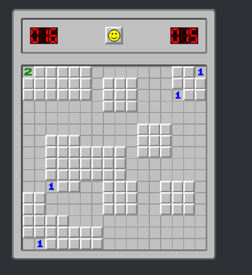

## This project have been deployed on vercale and you could [follow the link](https://saper-react-version.vercel.app/) to check it

Description:
* Goal of Minesweeper game is to flag all bombs on the field without revealing them;
* Project build with help of **React** + **Styled-components** + **TypesScript** and **Zustand**;
* It have been used cycles and recursion to generate playground and logic for revealing empty fields;
* Components, business and app logic are separated. 

***

## Проект задеплоен на vercale и вы можете посмотреть [следуя по ссылки](https://saper-react-version.vercel.app/)

Описание:
* Цель игры сапер в пометке всех бомб на поле флажками при этом не открывая данные ячейки;
* Проект написан на **React** + **Styled-components** + **TypesScript** и **Zustand**;
* Используются циклы и рекурсия для генерации игрового поля и открытия пустых ячеек;
* Компоненты, бизнес логика и логика приложений разделены между собой.

***

## Getting Started with Create React App

This project was bootstrapped with [Create React App](https://github.com/facebook/create-react-app).

### Available Scripts /Доступные скрипты

In the project directory, you can run:

#### `npm start`

Runs the app in the development mode.\
Open [http://localhost:3000](http://localhost:3000) to view it in your browser.

#### `npm run build`

Builds the app for production to the `build` folder.\
It correctly bundles React in production mode and optimizes the build for the best performance.
